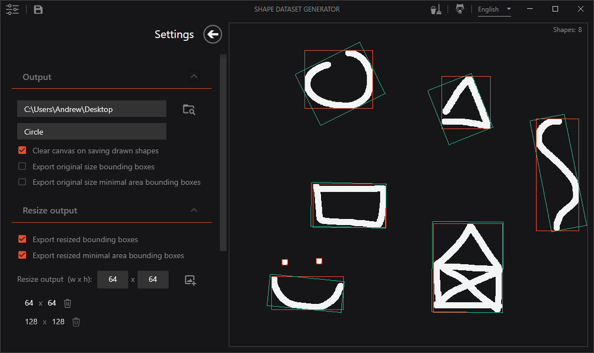

# ShapeDatasetGenerator.WPF
 
This is a very basic "drawing" application that allows the user to draw multiple simple shapes and save all of the shapes on the canvas at once to the hard drive.
The main purpose of it is to be able to rapidly generate human drawn shapes as datasets that can be used for machine learning tasks.

WORK IN PROGRESS :)

